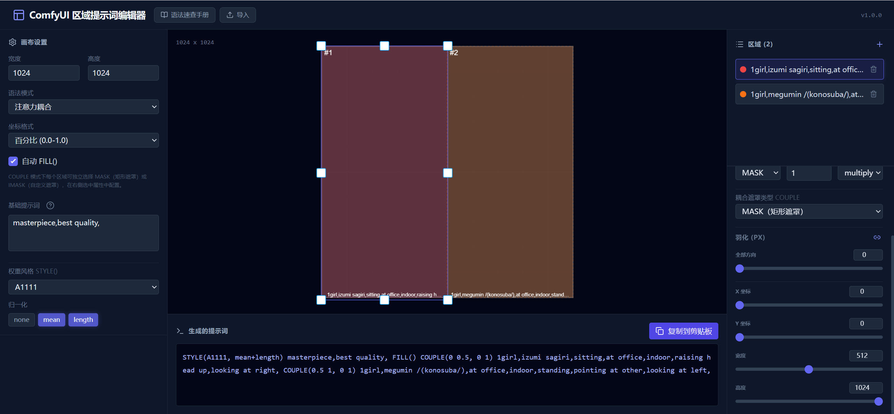
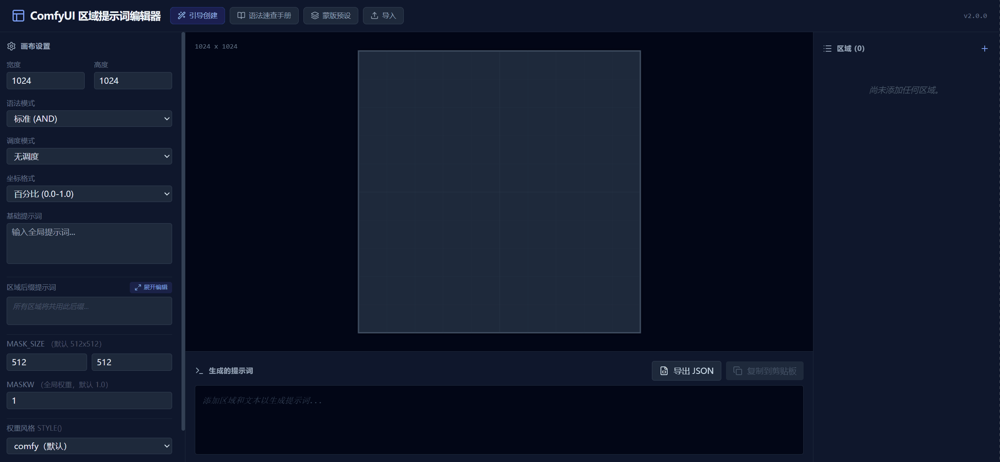

# ComfyUI PC Region Composer

一个 ComfyUI 自定义节点，提供可视化区域提示词编辑器入口。点击节点按钮即可打开编辑器，通过图形化界面生成符合 [ComfyUI Prompt Control](https://github.com/asagi4/comfyui-prompt-control) 语法的区域提示词。

**重要说明**：本项目的作用**仅**是辅助生成符合 ComfyUI Prompt Control 语法的提示词。要正确使用本工具，请务必**反复阅读 docs/ 目录中的详细文档**，理解区域提示、注意力耦合、调度模式等核心概念。


## 安装

将本项目放入 ComfyUI 的 `custom_nodes/` 目录：

```bash
cd ComfyUI/custom_nodes/
git clone https://github.com/gasdyueer/comfyui-pctextencode-region-composer.git
```

重启 ComfyUI 即可。

## 使用方法



**重要提示**：在使用本工具前，请务必先阅读 docs/ 目录中的文档，特别是：
- [快速入门](./docs/01-快速入门.md) - 基础操作指南
- [提示词语法大全](./docs/03-提示词语法大全.md) - 理解 Prompt Control 语法
- [区域提示与注意力耦合](./docs/04-区域提示与注意力耦合.md) - 核心概念详解

**基本步骤**：
1. 在 ComfyUI 中右键添加节点 → `Gasdyueer/region` → **PC Region Composer**
2. 点击节点内的 **Open Region Editor** 按钮，打开可视化编辑器
3. 在编辑器中拖拽创建区域、填写提示词、配置参数
4. 复制编辑器生成的 Prompt Control 语法字符串
5. 粘贴到 `PC: Schedule prompt` 节点使用

```
PC Region Composer → 复制提示词 → PC: Schedule prompt
```

## 可视化编辑器


编辑器支持以下功能：

- **拖拽创建和调整**：在画布上直观地创建、移动和调整区域大小
- **区域排序**：在区域列表中通过 ↑/↓ 按钮调整区域顺序，控制提示词输出顺序
- **两种组合模式**：AND（多区域叠加）/ COUPLE（注意力耦合）
- **两种区域类型**：MASK（潜空间遮罩）/ AREA（分区域独立计算）
- **坐标格式**：百分比 / 像素
- **羽化（Feather）**：四边独立像素值
- **遮罩合成操作**：multiply / add / subtract / intersect
- **蒙版预设**：内置 9 种常用区域布局预设（左右分屏、上下分屏、三栏、四宫格等），一键应用并自动切换模式
- **调度模式**：为每个区域设置时间区间（采样进度百分比），不同区间的提示词将按调度语法嵌套输出
- **一键复制**：快速复制生成的提示词或 JSON 配置
- **导入恢复**：粘贴提示词字符串或 JSON 即可恢复编辑状态，继续编辑

## 项目结构

```
├── __init__.py              # 节点注册 + WEB_DIRECTORY
├── region_composer_node.py  # Python 节点：编辑器入口按钮
├── web/
│   ├── region_composer.js   # ComfyUI 前端扩展（Open Editor 按钮）
│   └── editor/              # vite build 产物（可视化编辑器）
├── src/                     # React 编辑器源码
│   ├── App.tsx              # 主组件
│   ├── index.tsx            # 入口
│   ├── index.css            # 全局样式
│   ├── constants.ts         # 常量与初始状态
│   ├── types.ts             # TypeScript 类型定义
│   ├── components/          # React 组件
│   └── utils/               # 工具函数（含 promptGenerator.ts、promptParser.ts）
├── docs/                    # 文档
│   ├── 01-快速入门.md
│   ├── 02-节点详解.md
│   ├── 03-提示词语法大全.md
│   ├── 04-区域提示与注意力耦合.md
│   └── 05-LoRA调度与高级技巧.md
├── index.html               # Vite 入口 HTML
├── vite.config.ts           # Vite 配置
├── tsconfig.json            # TypeScript 配置
└── package.json             # 依赖管理
```

## 开发

```bash
npm install
npm run dev          # 启动开发服务器 http://localhost:3000
npm run build        # 构建到 web/editor/
```

## 相关资源

**核心文档（必读）**：
- [快速入门](./docs/01-快速入门.md) - 基础操作指南
- [节点详解](./docs/02-节点详解.md) - 节点功能说明
- [提示词语法大全](./docs/03-提示词语法大全.md) - **必须理解**的 Prompt Control 语法
- [区域提示与注意力耦合](./docs/04-区域提示与注意力耦合.md) - **核心概念**详解
- [LoRA调度与高级技巧](./docs/05-LoRA调度与高级技巧.md) - 高级用法

**外部依赖**：
- [ComfyUI Prompt Control](https://github.com/asagi4/comfyui-prompt-control) - 必须安装的扩展

**重要提醒**：本工具是**辅助工具**，生成的提示词需要配合 ComfyUI Prompt Control 使用。请反复阅读上述文档，理解语法规则和概念后再使用。

## 常见问题

**Q: 生成的提示词在 ComfyUI 中不工作？**
确保使用 `PC: Schedule prompt` 节点，并安装 [ComfyUI Prompt Control](https://github.com/asagi4/comfyui-prompt-control) 扩展。

**Q: 区域边界生硬？**
增加羽化值（Feather），10-20px 通常可以产生平滑过渡。

**Q: MASK 和 AREA 有什么区别？**
`MASK` 全尺寸计算后应用遮罩，区域间可能有轻微渗透；`AREA` 分区域独立计算后合成，区域完全独立。

**Q: 如何从已有的提示词恢复编辑状态？**
点击编辑器顶部的"导入"按钮，粘贴之前生成的 Prompt Control 提示词字符串或导出的 JSON，即可恢复所有区域配置并继续编辑。

**Q: 调度模式如何使用？**
在编辑器侧边栏选择"调度模式"，然后为每个区域设置时间区间（起始%和结束%）。编辑器会自动生成嵌套的调度语法，如 `[区域A提示词:[区域B提示词:区域C提示词:0.5]:0.3]`。

## 许可证

MIT License
